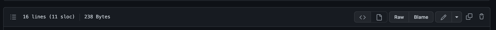
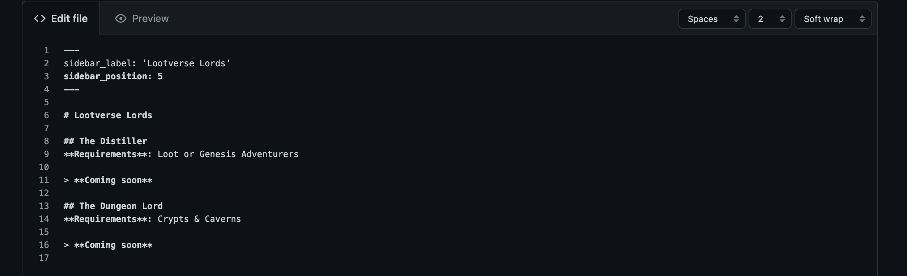
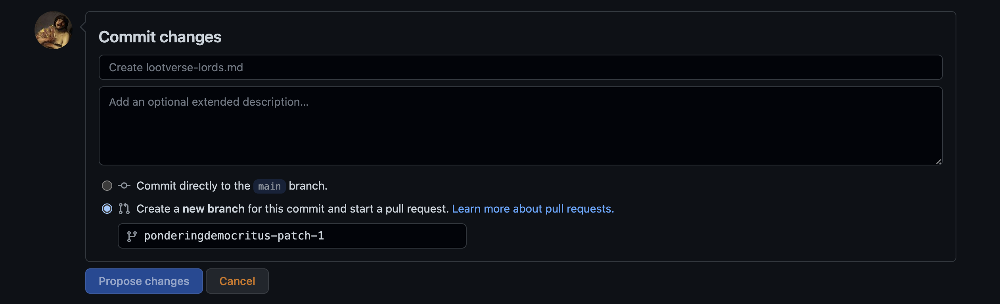
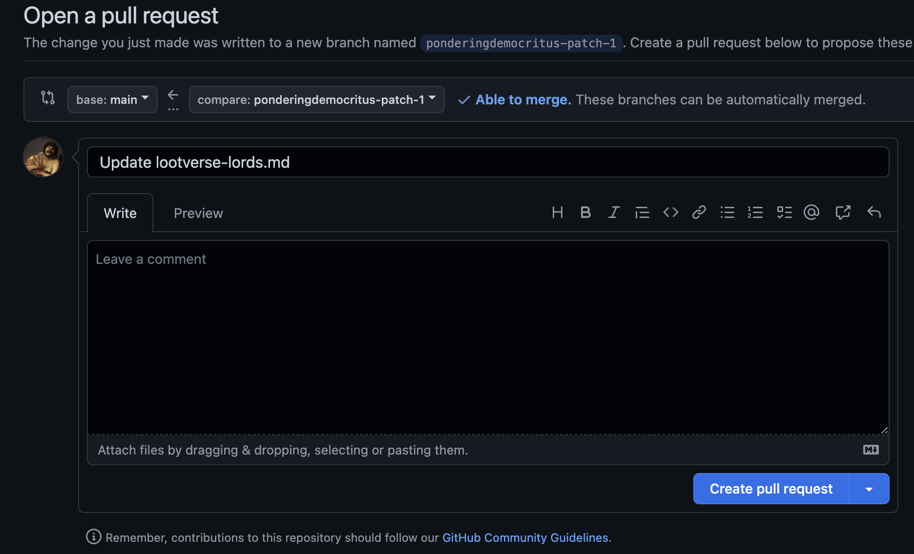

# The Players Guide to Eternum

> This guide is open-source and maintained by all players.

## Contributing to the guide

There are a few ways you can contribute to this guide - you don't need to be a developer! You only need a github account and understand `.md` Markdown files! Checkout the cheatsheet here: [Markdown Cheatsheet](https://www.markdownguide.org/cheat-sheet/)

### Before Starting

Make sure to make a [Github Account](https://github.com/)

## Easiest - No downloading

### Step 1

Navigate to the the page you wish to edit. There is an `edit this page` link on the right of the page. Or find the page directly in the project directory.

### Step 2

Click the edit button. This is the `pencil`. 



### Step 3

Make the changes in the Markdown file. Don't forget the [Markdown Cheatsheet](https://www.markdownguide.org/cheat-sheet/) !



### Step 4

Scroll down the page then commit your changes with a message about what you have just changed.



### Step 5

Create a message about what your changes are. A list of changes is suitable.

You have just made changes! A reviewer will look over these and then merge them into the main if no errors exist.




## Harder - Forking

### Forking

You know what to do...

---

### Running locally

The app is a nextjs app. 

Clone the:

```
yarn

yarn dev
```