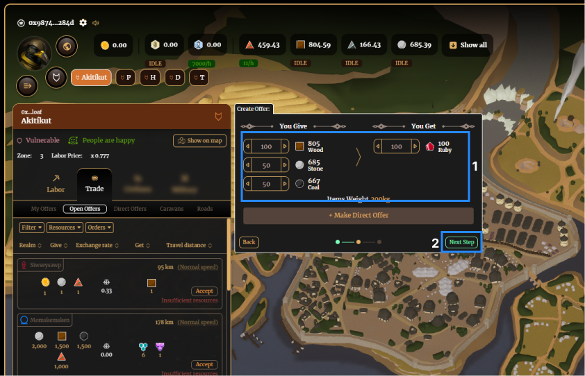
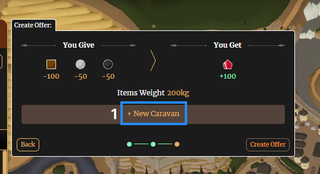

# Trade

Insert intro

## Creating offers

1. Navigate to manage Realms, select a Realm, and click on Trade.

2. Select ‘Create new offer’, choose which resources you are giving and receiving in the trade, and then click ‘Next Step’.

3. Create the offer

A) Market Offer: Input the amount of resources you are offering to give for what you are wanting to receive. If you are wanting to create a market offer (for anyone to accept), click ‘Next Step’

B) Direct Offer: If you want to create an offer for a specific person to accept (whether it’s between your own Realms, an ally from the same order, or a cross-order deal), follow these steps:

- Input the amount of resources you are offering to give for what you are wanting to receive
- Click ‘Make Direct Offer’
- Select the Realm you are creating the offer for (you can filter via Order, Realm ID, Name and Distance)
- Click ‘Next Step’

4. You must click ‘+ New Caravan’ (unless you have an idle caravan from previously), increase the number of donkeys until the caravan capacity turns green (enough donkeys to carry the weight), and then click ‘Create Offer’.

5. You can view your offers under the 'My Offers'. Once they have been accepted by the other party, this is where you will claim them (once their caravan has reached arrived at your Realm).

