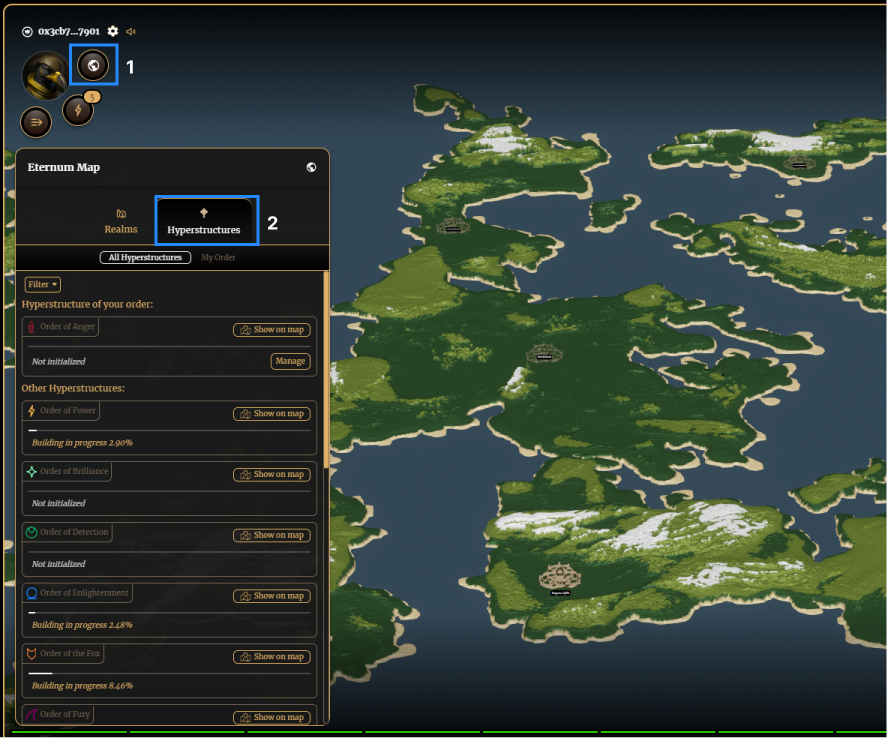

# Hyperstructures

The hyperstructure game creates a common goals for players within the same order. There is one hyperstructure for each order, and they require huge amount of resources to be completed. This is practically impossible to do alone, so it creates the need for strong collaboration between orders.

## Initialization

To initialize a Hyperstructure, a large sum of resources must be sent to the Hyperstructure from one Realm. This means that the first step requires quite a bit of coordinations, whether it’s trading between a player’s Realms, or with other players from the same order. Initialization only has to occur once per Hyperstructure.

1. Navigate to the World/Home button, and toggle the Hyperstructure tab. 

2. Click on ‘Manage’ on the Hyperstructure card of your order to view the initialization cost, and click ‘Next Step’.

3. Select the Realm you are wanting to intialize with (as pictured this player doesn’t have the required resources to progress) and click ‘Next Step’.

4. Create a caravan to carry the resources to the Hyperstructure and click ‘Send’

5. You must wait until the caravan arrives - navigate to the caravan tab to check on it’s progress. It takes 24 hours. Once arrived, you must select ‘Empty & return’ to complete the initialization.

## Sending resources

After initialization, there remains a bulk amount of resources that are required to complete it. Unlike initialization, you can send as little or as many of any resource - from here every Realm of the order can contribute without having to accumulate the initial bulk amount. 

The process is the same as above (initialization), but you can send any amount of resources per caravan.

