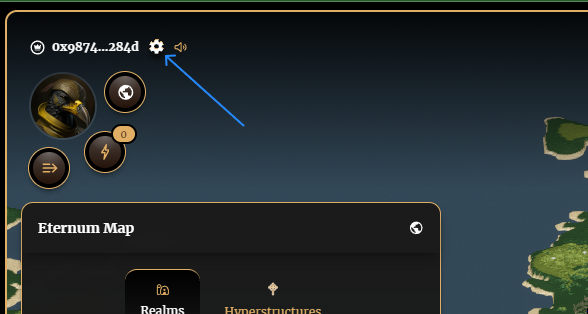
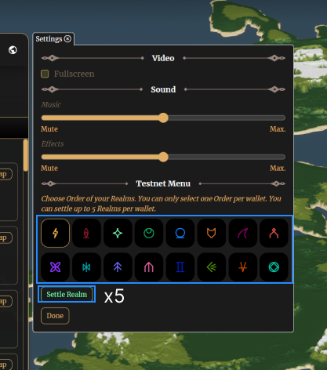

## Mint & Settle Your Realm(s)

**_To begin playing you must first settle (stake) your Realm(s) into the game contracts._**

1. Click the cog at the top left beside your wallet address

2. Select an order (you can only choose one per wallet) and settle up to 5 Realms (simply click Settle Realm five times)

--
1. Go to the 'Empire' screen and select 'Get Started'

2. Add at least 1 Realm (5 max) and click 'Mint Realms' (this will also add the approval transaction for all game contracts).

3. Sign the command in your Transaction Cart and approve in your StarkNet wallet.

4. Once approved, the mint page will update to the settling page (if you navigate away, simply click the 'Get Started' again). Check the boxes next to your Realm(s) to settle, and then click 'Settle Realms'

5. Sign the command in your tx cart and approve in your StarkNet wallet

6. Your Realm(s) will be settled as soon as the transaction is approved and you will receive:

**Per Realm**
- 10x $LORDS
- 1x day of resources directly in your bank
- 1x defensive army
- 1x attacking army

**_Note: This initial bonus is a one-time occurrence - if you unsettle and settle again, you will not receive the bonus again._**
