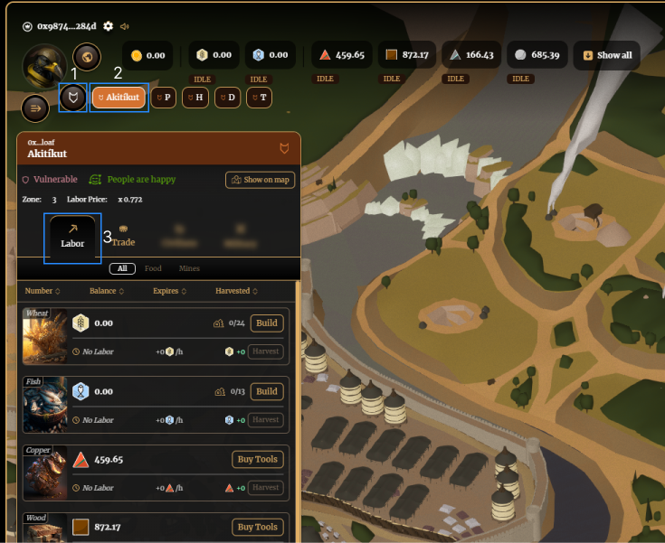
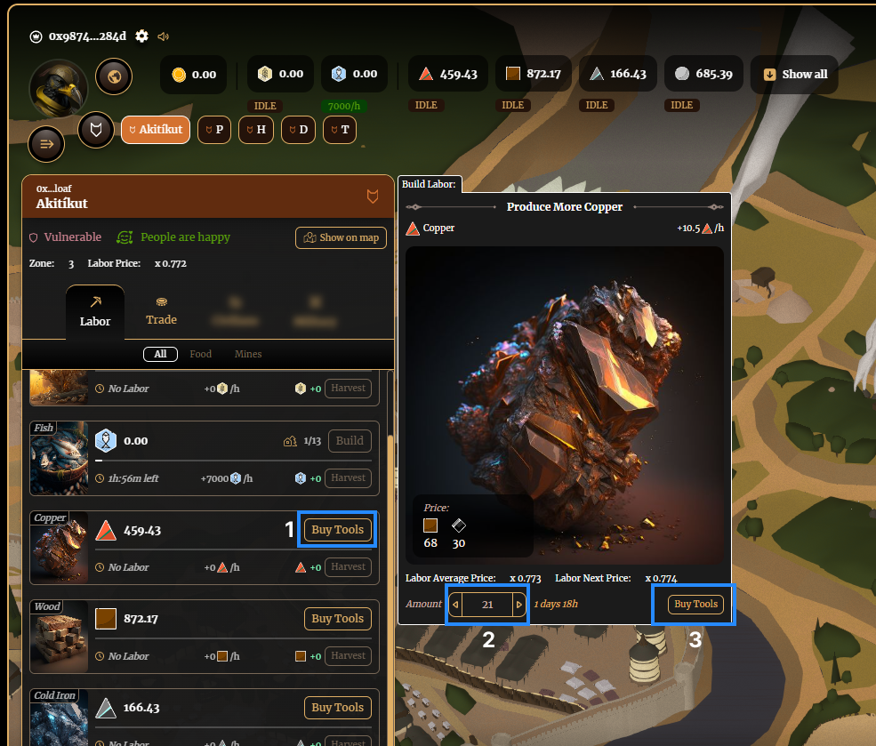
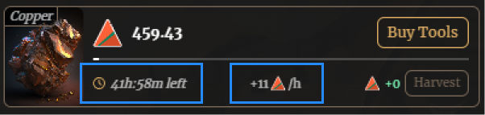
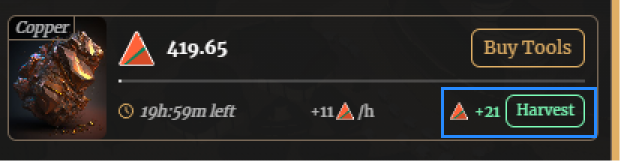
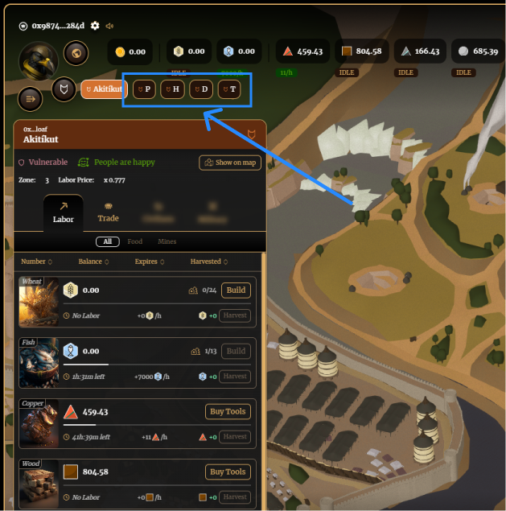

# Resources and Food

## Tools & Labor

Each realm can produce resources, wheat and fish. Production of resources requires tools & labor, based on a system called [Proof of Labor](https://medium.com/@bibliothecaDAO/introducing-proof-of-labor-to-realms-eternum-774cc1a86bc). Tools and labor can be purchased in 2hr increments. This means that when you purchase 1 unit of tools and labor to produce a resource, production will begin immediately and continue for 2hrs. After that production halts. If you want to produce for 24hrs, you would purchase 12 units of tools and labor. Currently 11 units of resources and food are produced and are made available to harvest every hour.

## Production

1. Navigate to manage Realms, select a Realm, and click on Labor.

2. Click on ‘Buy Tools’ (or Build farms) on the resource you want to produce, input the amount of tools you want to buy, and then click ‘Buy Tools’ to finalize

3. Depending how many hours of tools you purchased (each unit of tools is 2 hours), 11 units of the resource will become available to harvest after every hour.

## Harvesting

1. Navigate to manage Realms, select a Realm, and click on Labor.

2. If an hour has passed since you purchased tools, click the ‘Harvest’ button to claim your resources.

3. Click through your other Realms to harvest other resources you have purchased tools for. 

