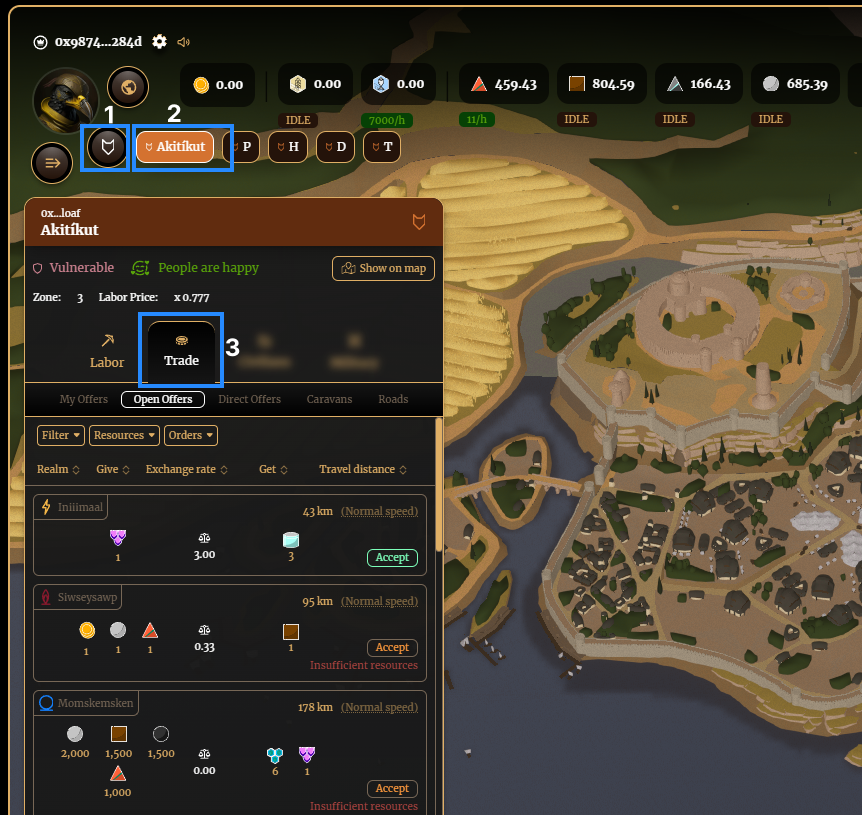

# Trading Resources & Food

There are two types of offers, open and direct. Open offers are open to every player in the game to accept, while direct offers are offered exclusively to a Realm. The advantage of the latter is that you can trade with yourself if you need to disperse your resources/food across Realms, or you can make strategic trades with other Realms of your order via off-chain coordination (or onchain via the World Chat).

Note: in the future there will be Banks which will allow for quicker trading/purchasing of resources and food, but will incur a fee. This will be implemented soon. 

## Creating offers

1. Navigate to manage Realms, select a Realm, and click on Trade.

2. Select ‘Create new offer’, choose which resources you are giving and receiving in the trade, and then click ‘Next Step’.

3. Create the offer

A) Market Offer: Input the amount of resources you are offering to give for what you are wanting to receive. If you are wanting to create a market offer (for anyone to accept), click ‘Next Step’

B) Direct Offer: If you want to create an offer for a specific person to accept (whether it’s between your own Realms, an ally from the same order, or a cross-order deal), follow these steps:

- Input the amount of resources you are offering to give for what you are wanting to receive
- Click ‘Make Direct Offer’
- Select the Realm you are creating the offer for (you can filter via Order, Realm ID, Name and Distance)
- Click ‘Next Step’

4. You must click ‘+ New Caravan’ (unless you have an idle caravan from previously), increase the number of donkeys until the caravan capacity turns green (enough donkeys to carry the weight), and then click ‘Create Offer’.

5. You can view your offers under the 'My Offers'. Once they have been accepted by the other party, this is where you will claim them (once their caravan has reached arrived at your Realm).

## Accepting Offers

You can accept two types of offers: 

1. Navigate to manage Realms, select a Realm, and select the ‘Trade’ tab

2. Accept your offers

A) Open offers: Navigate to the ‘Open Offers’ tab, build roads to reduce the time it will take to be arrive (optional), and click on ‘Accept’ on any offer you desire (if you have the resources to trade)

B) Direct offers: Navigate to the ‘Direct Offers’ tab, build roads to reduce the time it will take to be arrive (optional), and click on ‘Accept’ on any offers you have been sent directly.

3. Create a new caravan or select an idle caravan for the trade, and click ‘Accept Offer’

## Claiming offers

Once you have accepted a trade, it will appear in the ‘My Offers’ tab, and will update from ‘On the way’ to ‘claim’ once the timer has ended (currently it shows 0 days 0h when the remaining time is less than an hour)

1. Navigate to manage Realms, select a Realm, the ‘Trade’ and ‘My Offers’ tabs.

2. Click ‘Claim’ on any offer thas has arrived at your Realm by caravan.

